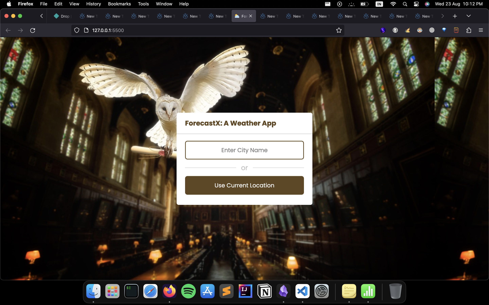
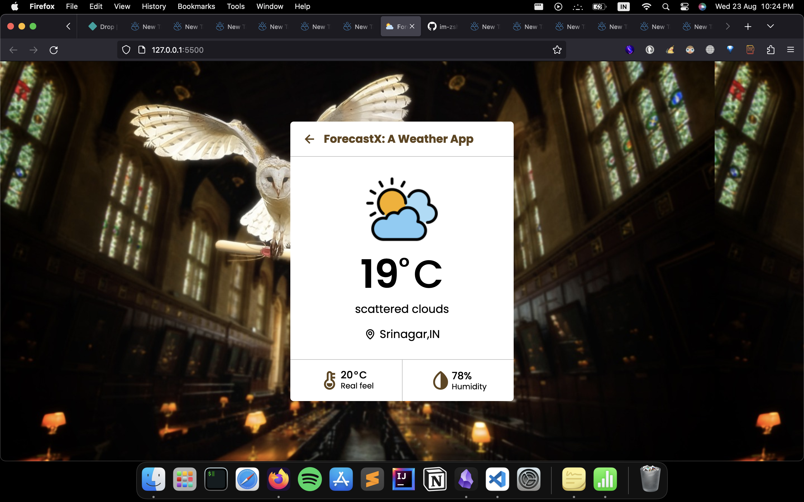
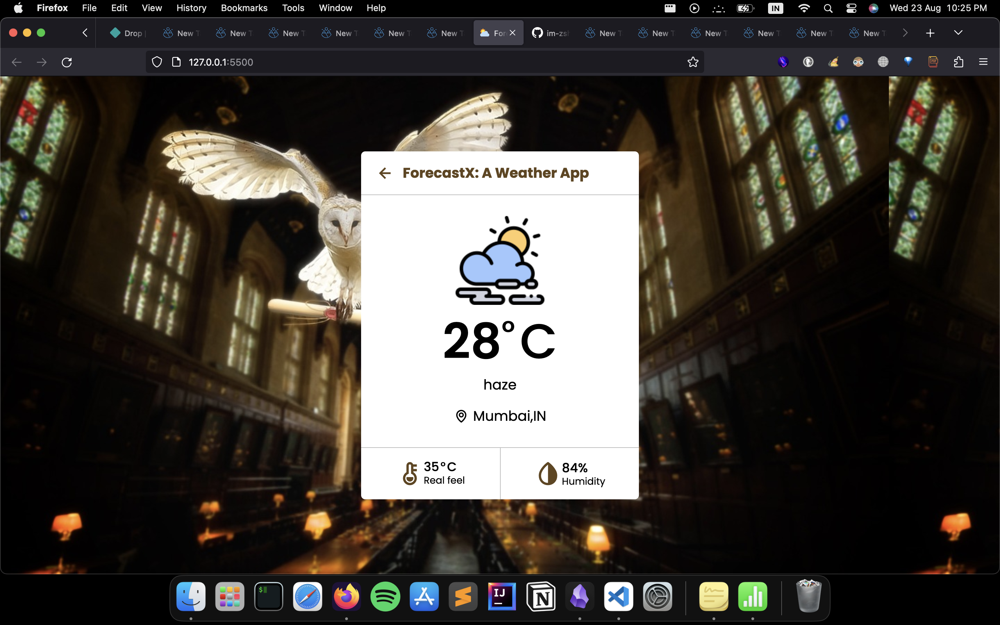

# ForecastX: A Weather App

ForecastX is a user-friendly weather application that provides real-time weather forecasts and information to help users stay prepared for any weather conditions. With an intuitive interface and accurate data, ForecastX is your go-to tool for staying informed about the weather.

## Features

- **Real-time Weather Data:** Get up-to-the-minute weather updates for your location.
- **Location-based Forecast:** Accurate weather forecasts based on your current location.
- **Detailed Information:** View detailed weather information including temperature, humidity, real feel, and more.

## More to be added like -

- **Daily and Hourly Forecasts:** Plan your day with hourly and daily weather forecasts.
- **Interactive Maps:** Visualize weather patterns with interactive maps and radar imagery.
- **Customizable Settings:** Set your preferred units (Celsius/Fahrenheit, km/h/mph, etc.) for a personalized experience.

## Screenshots







## Getting Started

To get started with ForecastX, follow these steps:

1. **Clone the Repository:**
   ```bash
   git clone https://github.com/yourusername/forecastx.git
   ```

2. **Navigate to the Project Directory:**
   ```bash
   cd forecastx
   ```

3. **Install Dependencies:**
   ```bash
   npm install
   ```

4. **Start the Development Server:**
   ```bash
   npm start
   ```

5. **Access the App:**
   Open your web browser and navigate to `http://localhost:5500` to use ForecastX.

## Technologies Used

- Frontend: HTML, CSS, JavaScript
- Backend: Node.js, Express (for serving API requests)
- Weather Data: [Open Weather Map API Source]

## Developers

- Zeeshan Chowdhary (Developer) - [GitHub](https://github.com/im-zshan)

## Feedback and Support

If you have any feedback, suggestions, or issues, please feel free to reach out to us. You can contact the developer at zeeshanchowdhary786@gmail.com.

## License

This project is licensed under the [MIT License](LICENSE).

---

Thank you for choosing ForecastX! We hope this weather app enhances your daily planning and keeps you prepared for whatever the weather brings.
